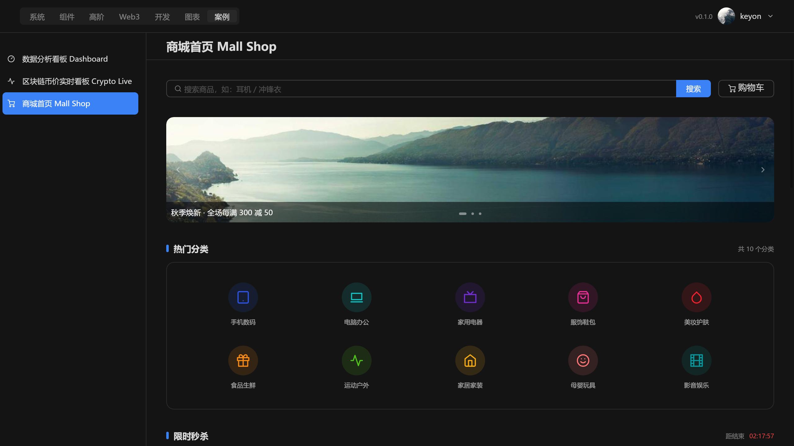
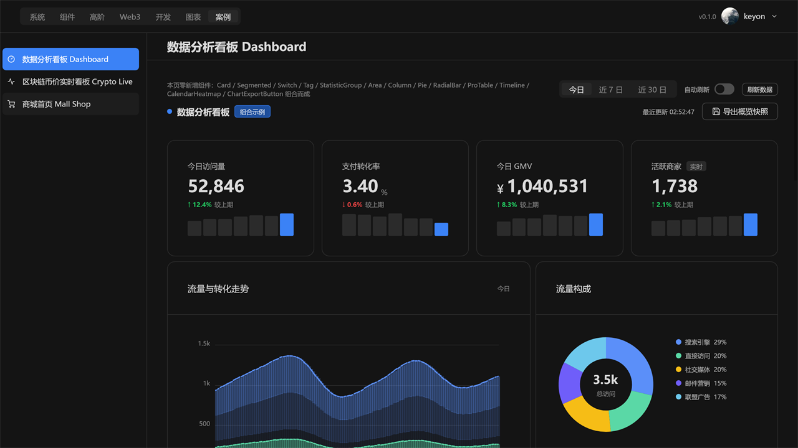
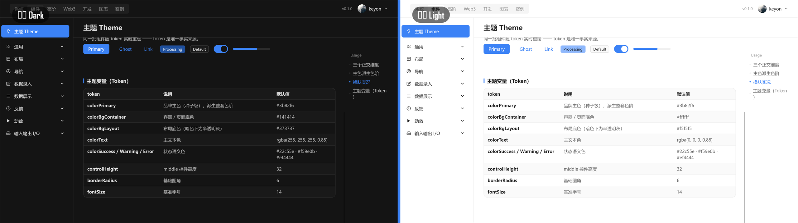
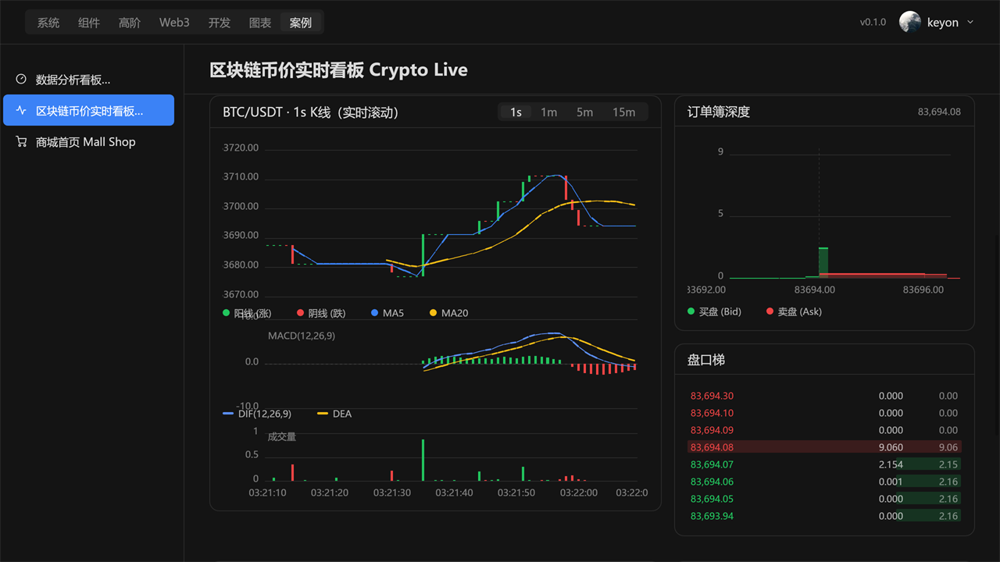

# react-native-flux-desktop-gallery

> ️ The browsable demo showcase for the whole `react-native-flux-desktop` ecosystem — 100+ component demos, charts, Web3 widgets, dev tools and full-app case studies, all rendered by the self-drawn stack (no browser).
> 🖼️ 整个 `react-native-flux-desktop` 生态的可交互 demo 总览 —— 100+ 组件示例、图表、Web3、开发工具与整站案例，全部由自绘栈渲染（无浏览器）。

  

**Consumes / 消费：** `react-native-flux-desktop` (core) · `-chart` · `-dev` · `-pro` · `-web3` · `-webview` — wired up as `file:../…` local deps, so this app is the reference for how the packages compose in real screens.

> 📦 This is a **demo application**, not a library. It is `private` (not published to npm) and exists so you can read how every component is actually used — it is the source of the screenshots you see across the package READMEs.

[中文文档](./README.zh-CN.md)

---

## Showcase

<table>
  <tr>
    <td align="center"><b>Hero · system overview</b><br/></td>
    <td align="center"><b>Dashboard case</b><br/></td>
  </tr>
  <tr>
    <td align="center"><b>Design tokens</b><br/></td>
    <td align="center"><b>Web3 · CoinIcon</b><br/></td>
  </tr>
</table>

## What's inside

The left rail is grouped into six sections; the top bar toggles theme (light/dark), density, primary color, the **CPU / GPU** render tier, DPR (100 / 150 / 200%) and shows live FPS / memory:

| Section | Contents |
| --- | --- |
| **System 系统** | Lifecycle, rendering, fonts, events, window, multi-window, KV store, logger, tray, system methods |
| **Components 组件** | The full base kit — Button, Input, Select, Menu, Table, Modal, Drawer, Tabs, DatePicker, Tree, Upload, Form … (Ant-Design-style) |
| **Web3** | CoinIcon (560 coins), Address, TokenPrice, PriceRange, NFTCard, Web3Avatar, live crypto dashboard |
| **Dev 开发** | CodeBlock, Markdown, JsonViewer, DiffViewer, Terminal / LiveTerminal / SshTerminal, LogViewer, CommandPalette, RegexTester, CronParser, TimeConverter, Mem/Fps monitors |
| **Charts 图表** | Basic / advanced / financial / relationship charts — line, bar, candlestick, sunburst, treemap, sankey, dendrogram, mind-map, org-chart, flow-chart … |
| **Cases 案例** | A couple dozen full-app case studies (dashboard, admin CRUD, kanban, mail, chat, music, mall, wallet, file manager, weather …) |

## Getting started

Because the packages are linked with `file:../…`, this app expects the sibling folders to sit **next to it** in one workspace:

```
flux/
├─ react-native-flux-desktop/          # core (compiled dist)
├─ react-native-flux-desktop-chart/
├─ react-native-flux-desktop-dev/
├─ react-native-flux-desktop-pro/
├─ react-native-flux-desktop-web3/
├─ react-native-flux-desktop-webview/
├─ react-native-flux-desktop-packer/
└─ gallery/                            # ← this repo
```

```bash
cd gallery
npm install          # resolves the file:../ siblings above
npm start            # build (tsc) + run, CPU render
npm run gpu          # run in GPU render mode
npm run dev          # dev runner
```

Other scripts:

| Script | Does |
| --- | --- |
| `npm run pack` | Package into a self-contained `.exe` via `flux-pack` (Go launcher + `go:embed`) |
| `npm run dist` | Produce a distributable folder (`tools/make-dist.js`) |
| `npm run vreg` / `vreg:update` / `vreg:all` | Visual-regression capture & diff against baselines |

## Configuration

App-level settings live in **`app.json`**: window `icon`, `name`, `maxDpr` (capped at 2), the `fonts` table (system fonts registered before first frame via `registerFonts`), `logger`, and `pack` (`mode: "sea"`). See the core package README for the full font/resource model.

## Notes

- **Rendering**: switch CPU ⇄ GPU from the top bar (or `npm run gpu`); both drive the exact same component tree.
- **Fonts**: the demo registers a handful of Windows fonts (黑体 / 楷体 / 仿宋 / 幼圆 / 华文行楷 / Arial / Consolas) to exercise the global-vs-local font system and the CJK tofu-fallback chain.
- **Standalone clone**: if you clone *only* this repo, `npm install` will fail on the `file:../…` paths — place the sibling packages alongside it (see layout above), or repoint them to published npm versions.

## License

Part of the `react-native-flux-desktop` project (MIT). This gallery app is `private` and distributed as sample source.

> 中文文档见 [README.zh-CN.md](./README.zh-CN.md)。
